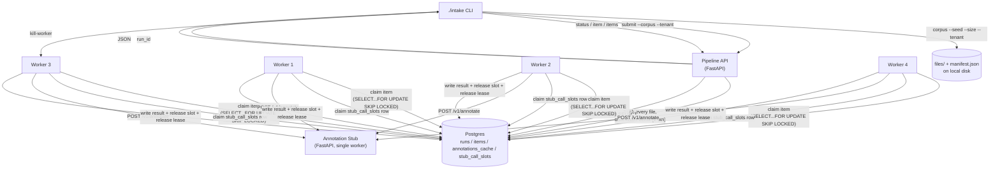

# Architecture

Current as of M1 design. Kept up to date through M2 (scenario runner, fault injection, and the
M2-specific decisions D-05–D-07 will extend this doc, not replace it).

## Components

| Component | What it is | Runs as |
|---|---|---|
| Postgres | The only durable store: run/item state, extracted text, annotations, the work queue, the capacity semaphore | Container (the one piece required to be containerized) |
| Stub | Simulated annotation dependency (section 5 of the brief) | Native process, single Uvicorn worker, foreground under `./intake stub` |
| Pipeline API | FastAPI service: `submit`, `item`, `items`, `status`. The only writer of new runs/items; enforces tenant scoping on every read and write | Native process, launched by `./intake up` |
| Worker (×N) | Standalone script; claims one item at a time from Postgres, processes it, writes the result | Native OS process, one per worker, launched by `./intake up --workers <n>` |
| CLI (`./intake`) | Dispatches subcommands: some run local logic directly (`corpus`, `stub`), some manage container/process lifecycle (`up`/`down`/`reset`/`kill-worker`), some are thin HTTP clients to the Pipeline API (`submit`/`status`/`item`/`items`) | Entry point |

Only Postgres is containerized (D-11). The corpus directory (`--out <dir>`) can be anywhere on
the host filesystem, and containerizing the stub/API/workers would mean volume-mounting
arbitrary host paths for no benefit — native processes also keep localhost networking to the
stub trivial. Workers are separate OS processes from M1 onward, not upgraded later (D-12):
`./intake up` tracks each worker's PID (and the stub/API PIDs, and the Postgres container ID) in
a local state file so `down` and `kill-worker` know what to stop.

## Data flow



## Work handoff (the two hardest structural problems)

**Item ownership (D-01).** A worker claims exactly one item at a time with:

```sql
UPDATE items
SET state = 'in_progress', leased_by = $worker_id, leased_until = now() + $lease_ttl
WHERE id = (
  SELECT id FROM items
  WHERE state = 'pending' OR (state = 'in_progress' AND leased_until < now())
  ORDER BY created_at
  LIMIT 1
  FOR UPDATE SKIP LOCKED
)
RETURNING *;
```

If the owning worker is SIGKILLed, no one releases the lease explicitly — the item simply
becomes claimable again once `leased_until` passes, purely because every future claim attempt's
own `WHERE` clause already covers expired leases. No reaper process, no supervisor, no shared
memory between the four workers: Postgres is the only thing they share, and it already
serializes the claim correctly under `SKIP LOCKED`.

Default item lease TTL: 5 seconds, renewed (or released on terminal write) well before expiry
during normal processing. Chosen to comfortably exceed one attempt's worst-case duration (stub
latency + HTTP timeout, finalized under D-05) while still leaving room inside the 10-second
recovery bound for detection + re-claim + reprocessing.

**Capacity gate (D-08).** The stub allows only `in_flight_capacity` (default 2) concurrent calls,
enforced across all four workers with `over_capacity_calls` required to stay at exactly zero.
This is a *different* resource than item ownership — a worker can hold an item's lease without
being mid-HTTP-call. A `stub_call_slots` table, seeded with `in_flight_capacity` rows at startup
(config-driven, same value passed to the stub via `STUB_IN_FLIGHT_CAPACITY` — never a duplicated
literal), is claimed with the identical lease-and-self-heal pattern immediately before a stub
call and released in a `finally` immediately after. A killed worker's held slot expires and
becomes claimable the same way an abandoned item does.

## Per-item processing

1. Claim item (above).
2. Empty bytes → terminal `empty_content`. `.json` failing `json.loads` → terminal
   `decode_failed`. Both detected before anything touches the stub or `stub_call_slots`.
3. Extract text for `.txt`/`.json`/`.csv`. `.png` gets no extracted text but still proceeds to
   annotation — extractability is not grounds to skip the call.
4. Look up `annotations_cache` for `(tenant, sha256)` where `tenant` is read from the claimed
   `items` row (D-10 — never from anywhere else, since workers bypass the API's tenant scoping
   entirely). Hit → reuse, terminal `succeeded`, no HTTP call. Miss → claim a capacity slot,
   insert an `item_attempts` row *before* sending the request (D-09), call the stub, update that
   row with the outcome, release the slot, write the annotation to both `items` and
   `annotations_cache` on success.
5. Terminal state: `succeeded`, or (retry policy pending D-05) `annotation_failed` /
   `annotation_invalid_request`.

## Data model (Postgres)

- `runs(run_id PK, corpus_id, tenant, submitted_at)`
- `items(item_id PK, run_id FK, tenant, source_path, extension, bytes, sha256, role, duplicate_of, edge_case, expects_annotation, state, leased_by, leased_until, reason JSONB, extracted_text TEXT NULL, annotation JSONB NULL, created_at, updated_at)`
- `annotations_cache(tenant, sha256, annotation JSONB, created_at, PRIMARY KEY(tenant, sha256))`
- `stub_call_slots(slot_id PK, held_by TEXT NULL, lease_until TIMESTAMPTZ NULL)` — row count = `in_flight_capacity`
- `item_attempts(attempt_id PK, item_id FK, tenant, attempt_no, started_at, worker_id, slot_id, completed_at NULL, http_status NULL, outcome NULL)` — append-only (D-09)

Query surface (`item`/`items`/`status`) reads these tables directly through the Pipeline API —
no separate read path, no cache layer beyond `annotations_cache` itself (D-03).

## Deferred (M2)

Retry/backoff policy (D-05), secondary thresholds (D-06), and environment-fidelity discussion
(D-07) are recorded as open in `DECISIONS.md` and will be resolved and reflected here once the
M2 scenario harness is being built.
