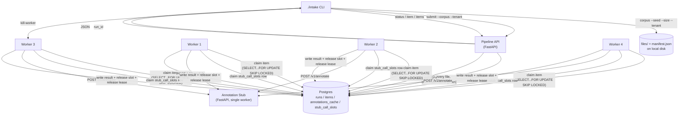

# Architecture

Current through M2's design (D-05 revision, D-06, D-07, D-15). The scenario runner itself is
specified in a separate doc — see "M2 scenario harness" below.

## Components

| Component | What it is | Runs as |
|---|---|---|
| Postgres | The only durable store: run/item state, extracted text, annotations, the work queue, the capacity semaphore | Container (the one piece required to be containerized) |
| Stub | Simulated annotation dependency (section 5 of the brief) | Native process, single Uvicorn worker, foreground under `./intake stub` |
| Pipeline API | FastAPI service: `submit`, `item`, `items`, `status`. The only writer of new runs/items; enforces tenant scoping on every read and write | Native process, launched by `./intake up` |
| Worker (×N) | Standalone script; claims one item at a time from Postgres, processes it, writes the result | Native OS process, one per worker, launched by `./intake up --workers <n>` |
| CLI (`./intake`) | Dispatches subcommands: some run local logic directly (`corpus`, `stub`), some manage container/process lifecycle (`up`/`down`/`reset`/`kill-worker`), some are thin HTTP clients to the Pipeline API (`submit`/`status`/`item`/`items`) | Entry point |

Only Postgres is containerized (D-11). The corpus directory (`--out <dir>`) can be anywhere on
the host filesystem, and containerizing the stub/API/workers would mean volume-mounting
arbitrary host paths for no benefit — native processes also keep localhost networking to the
stub trivial. Workers are separate OS processes from M1 onward, not upgraded later (D-12):
`./intake up` tracks each worker's PID (and the stub/API PIDs, and the Postgres container ID) in
a local state file so `down` and `kill-worker` know what to stop.

## Data flow



## Work handoff (the two hardest structural problems)

**Item ownership (D-01).** A worker claims exactly one item at a time with:

```sql
UPDATE items
SET state = 'in_progress', leased_by = $worker_id, leased_until = now() + $lease_ttl
WHERE id = (
  SELECT id FROM items
  WHERE (state = 'pending' AND (next_attempt_after IS NULL OR next_attempt_after <= now()))
     OR (state = 'in_progress' AND leased_until < now())
  ORDER BY order_index, created_at
  LIMIT 1
  FOR UPDATE SKIP LOCKED
)
RETURNING *;
```

`created_at` alone is not a sufficient ordering: `submit` inserts every item of a run inside one
transaction (D-14) and Postgres's `now()` is the *transaction* timestamp, so all of a run's items
share one `created_at`. `order_index` — the manifest's own `order` field, which lists originals
first, then duplicates, then edge cases, and starts at 0 independently within *each* run — is the
primary sort key (D-15). Within one run this is behaviorally identical to sorting by `created_at`
first (that value never varies within a run, so `order_index` was always the effective sole
differentiator) — D-02's intra-run cache benefit (originals claimed before their duplicates) is
unaffected. Across runs, ordering by `order_index` first means workers claim "position 0 from
whichever run has one" before moving to position 1, interleaving two concurrently-submitted runs
fairly instead of draining one run's entire backlog before ever touching the other's — the earlier
`created_at`-first ordering would have made a second run wait almost entirely behind the first's,
which M2's overlapping-load requirement cannot tolerate. `created_at` remains the tiebreaker so
ties within one position still resolve by submission order.

The `next_attempt_after` clause is D-05's backoff mechanism: a `pending` item that just failed a
retryable attempt is not immediately reclaimable, only once its backoff window passes (below).

If the owning worker is SIGKILLed, no one releases the lease explicitly — the item simply
becomes claimable again once `leased_until` passes, purely because every future claim attempt's
own `WHERE` clause already covers expired leases. No reaper process, no supervisor, no shared
memory between the four workers: Postgres is the only thing they share, and it already
serializes the claim correctly under `SKIP LOCKED`.

Item lease TTL: 5 seconds. Processing one item can span several stub attempts with backoff
(D-05) and easily exceed one lease window, so the worker runs a background thread that renews
the lease every 2 seconds while work continues:

```sql
UPDATE items SET leased_until = now() + interval '5 seconds'
WHERE item_id = $1 AND leased_by = $2 AND state = 'in_progress';
```

A renewal that affects 0 rows means this worker's lease was already stolen — the thread flips an
in-process flag the main loop checks between steps, so the worker abandons this item and moves
on rather than finishing work it no longer owns. That flag is a latency optimization, not the
correctness guarantee: the guarantee is that renewal *and* the eventual terminal write both
carry `WHERE leased_by = $worker_id`, so a stale worker's writes simply match zero rows once
someone else holds the lease — it can never resurrect a stolen item or clobber the new owner's
result, flag or no flag.

**Capacity gate (D-08).** The stub allows only `in_flight_capacity` (default 2) concurrent calls,
enforced across all four workers with `over_capacity_calls` required to stay at exactly zero.
This is a *different* resource than item ownership — a worker can hold an item's lease without
being mid-HTTP-call. A `stub_call_slots` table, seeded with `in_flight_capacity` rows at startup
(config-driven, same value passed to the stub via `STUB_IN_FLIGHT_CAPACITY` — never a duplicated
literal), is claimed with the identical lease-and-self-heal pattern immediately before a stub
call and released in a `finally` immediately after. A killed worker's held slot expires and
becomes claimable the same way an abandoned item does.

## Per-item processing

1. Claim item (above). Read the file's bytes from disk (a local read, not a stub call). Then,
   before anything is sent to the stub, check `item_attempts` for this item for an
   already-completed *successful* attempt (possible if a previous holder got a 200 back but died
   before writing `items.state`) — if found, re-read the annotation from `annotations_cache` by
   content hash (`item_attempts` stores the outcome, not the payload) and finalize from it,
   re-deriving `extracted_text` from the bytes read above. Step 5's commit ordering guarantees
   that cache row exists whenever a completed successful attempt does; in the impossible case
   that it doesn't, the worker falls through and reprocesses the item normally rather than
   finalizing `succeeded` with an empty annotation.
2. Empty bytes → terminal `empty_content`. `.json` failing `json.loads` → terminal
   `decode_failed`. Both detected before anything touches the stub or `stub_call_slots`.
3. Extract text for `.txt`/`.json`/`.csv`. `.png` gets no extracted text but still proceeds to
   annotation — extractability is not grounds to skip the call.
4. Look up `annotations_cache` for `(tenant, sha256)` where `tenant` is read from the claimed
   `items` row (D-10 — never from anywhere else, since workers bypass the API's tenant scoping
   entirely). Hit → reuse, terminal `succeeded`, no HTTP call.
5. Miss → make **one** attempt this invocation (D-05, revised for M2 — not an in-process retry
   loop; see below for why):
   - Count this item's rows in `item_attempts`. If already at the 5-attempt cap, skip straight to
     terminal `annotation_failed` — no new HTTP call. This check is durable (reads the actual
     historical count, not a per-invocation counter), so the cap holds regardless of how many
     times the item has been reclaimed by different workers.
   - Otherwise, claim a `stub_call_slots` row (D-08).
   - **Commit** an `item_attempts` insert (`started_at`, `worker_id`, `slot_id`, `attempt_no`) —
     this transaction lands *before* the HTTP call is sent.
   - `POST /v1/annotate`, 2s timeout.
   - On `200` only: **commit** the `annotations_cache` row for `(tenant, sha256)`. This lands
     *before* the attempt is marked complete, deliberately — see below.
   - **Commit** an `item_attempts` update (`completed_at`, `http_status`, `outcome`) — this
     transaction lands after the call returns (or the timeout fires).
   - Release the slot in a `finally`.
   - `200` → write the annotation and extracted text to `items`, terminal `succeeded`.
     `400` → terminal `annotation_invalid_request` immediately, no further attempts.
     `500`/`429`/timeout/connection-error (retryable) → **release the item** rather than retrying
     in place: `UPDATE items SET state='pending', leased_by=NULL, leased_until=NULL,
     next_attempt_after=now()+backoff WHERE item_id=... AND leased_by=$worker_id`, guarded the
     same way every other write is, then return. Backoff is `200ms × 2^(attempt-1)` capped at 2s
     with ±20% jitter, unchanged from the original policy.

The retry loop lives across separate claims now, not a `time.sleep` inside one call — a released
item is picked up by whichever worker's claim query reaches it once `next_attempt_after` passes,
which may or may not be the same worker. This replaced an earlier design where one `process_item`
invocation looped internally up to 5 times, sleeping between attempts while still holding the
item's lease. Two problems with that: first, if a worker died mid-sequence and a different worker
reclaimed the item, that worker's loop started over at attempt 1 — the cap was enforced by a
Python loop counter that reset on every reclaim, not by the durable `item_attempts` count, so an
item could accumulate more than 5 real attempts across its lifetime. Second, sleeping in-process
for backoff made that worker unavailable to claim other pending work for the whole backoff
window — under real concurrent two-tenant load (M2) this measurably reduces the number of workers
actually available at any moment. Releasing the item removes both problems: the cap is now read
fresh from storage on every claim, and a worker never blocks on backoff — it goes straight back to
claiming other work. Jitter's role shifted with it: it no longer desynchronizes sleeps, it
desynchronizes *when different failed items become reclaimable*, so a burst of failures doesn't
make many items reclaimable at the same instant and stampede the 2-slot gate together.

The cache commit precedes the attempt-completion commit because step 1's recovery path reads the
cache to reconstruct an annotation it can't get from `item_attempts`. Both commits are sequential
on one connection, so a later one cannot be durable unless the earlier one is: a completed
`outcome='success'` attempt therefore *implies* its cache row survived. The opposite order left a
crash window where an attempt row claimed success with the annotation nowhere on disk, and the
next claimant reported the item `succeeded` with an empty annotation — a silent data error
dressed as a success. This does not weaken D-09: the attempt insert still commits before the HTTP
call and the update still commits after it returns.

**Crash windows against this sequence** (all writes above are conditioned on
`leased_by = $worker_id`, so a stale worker can never complete a stolen item regardless of which
window it dies in):

| Worker dies... | State left behind | What happens |
|---|---|---|
| before the `item_attempts` insert commits | No attempt row for this try | Lease expires, reclaimed, retried fresh. No billing occurred, and nothing suggests otherwise. |
| after the insert commits, whether before the request was even sent, mid-flight, or after a response arrived but before the update commits | Row with `completed_at IS NULL` | Durable, queryable evidence of a *possibly*-billed, unrecorded attempt (D-09). Reconciliation reads this as "cannot rule out billing," never as confirmation — the row can't distinguish "died before sending" from "died waiting on the response," and the conservative reading is the safe one. This is the case M2 measures and explains, not one it can prevent. |
| after a `200`'s cache row commits, before the attempt update commits (a sub-case of the row above) | Cache row present; attempt still `completed_at IS NULL` | The next claimant finds no *completed* success, so it reprocesses from step 1 — but its step-4 cache lookup now hits, so it finalizes `succeeded` from the cache without re-calling the stub. The attempt row is still correctly readable as "cannot rule out billing." |
| after the update commits, before the slot is released | Attempt row complete; `stub_call_slots` row still marked held | The slot's own short lease expires and self-heals (D-08) — no special handling needed. |
| after a successful outcome is recorded, before `items.state` is written | Attempt row shows `outcome='success'`; item still `in_progress`; cache row guaranteed present (it committed first) | Next claimant finalizes from the completed `item_attempts` row plus the cache (step 1 above) instead of re-calling the stub. |
| after a retryable-failure outcome is recorded, before the release-with-backoff UPDATE commits | Attempt row shows a retryable `outcome`; item still `in_progress`, still `leased_by` the dead worker | The intended backoff window is skipped — the item instead becomes reclaimable via the ordinary lease-expiry self-heal (up to the 5s lease TTL), not `next_attempt_after`. Harmless: backoff paces retries for politeness under contention, it is not a correctness requirement, so a slightly earlier-than-intended retry here has no observable effect beyond a marginally more aggressive retry cadence. |
| the item's source file can't be read (`OSError`, e.g. deleted or unreadable after manifest generation) | Item finalized `processing_error` | Caught in `process_item` before any stub call and finalized immediately, non-retryable (D-04) — no lease-expiry retry loop, no `item_attempts` row, no worker crash. |
| anywhere else, with a genuinely unhandled exception rather than a kill (e.g. a transient Postgres error) | Item left `in_progress` | The worker logs a traceback to `.intake_logs/worker-N.log` and claims the next item rather than dying — one bad item must not take down a worker, and then each worker that reclaims it in turn. The item's lease expires and it is reclaimed and retried like any abandoned item. This path never reaches `item_attempts`, so it is not subject to the 5-attempt cap either — an item failing this way deterministically retries indefinitely. Narrower than before now that the file-read case above is carved out; the residual is genuinely unexpected infrastructure failure, not a detected permanent condition, so D-04 deliberately gives it no terminal state of its own. Out of scope for M2's scenario, which injects only one fault (a worker `SIGKILL`), not infrastructure failures of this kind. |

## Data model (Postgres)

- `runs(run_id PK, corpus_id, tenant, submitted_at)`
- `items(item_id PK, run_id FK, tenant, source_path, extension, bytes, sha256, role, order_index, duplicate_of, edge_case, expects_annotation, state, leased_by, leased_until, next_attempt_after TIMESTAMPTZ NULL, reason JSONB, extracted_text TEXT NULL, annotation JSONB NULL, created_at, updated_at)` — `order_index` is the manifest's `order` field (renamed off the reserved keyword) and is the primary claim/listing sort key, both within a run (originals before duplicates, D-02) and across runs (D-15); `next_attempt_after` is D-05's backoff timer, distinct from `leased_until` — a `pending` item with `next_attempt_after` in the future is not claimable yet even though nothing holds its lease
- `annotations_cache(tenant, sha256, annotation JSONB, created_at, PRIMARY KEY(tenant, sha256))`
- `stub_call_slots(slot_id PK, held_by TEXT NULL, lease_until TIMESTAMPTZ NULL)` — row count = `in_flight_capacity`
- `item_attempts(attempt_id PK, item_id FK, tenant, attempt_no, started_at, worker_id, slot_id, completed_at NULL, http_status NULL, outcome NULL, UNIQUE(item_id, attempt_no))` — insert commits before the stub call, update commits after (D-09)

Query surface (`item`/`items`/`status`) reads these tables directly through the Pipeline API —
no separate read path, no cache layer beyond `annotations_cache` itself (D-03).

## M2 scenario harness

D-05 (retry mechanism), D-06 (secondary thresholds), D-07 (environment fidelity), and D-15
(cross-run claim fairness) are all decided in `DECISIONS.md` and reflected above. The scenario
runner itself (`./intake scenario`'s paired control/fault execution, fault-injection timing, and
evidence output) is specified separately in
`docs/superpowers/specs/2026-09-04-m2-scenario-harness-design.md`, since it doesn't fit this
document's per-item/data-model structure — read that alongside this file for the full M2 picture.
